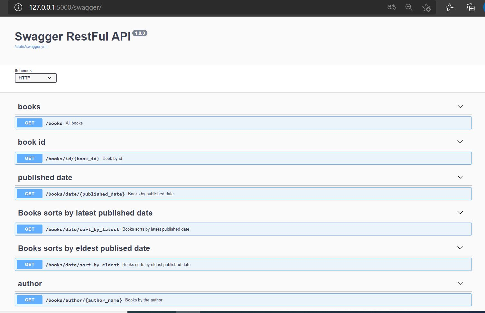

## **Flask-RESTful API**

### Installation
```
pip install requirement.txt

```
### Configuration
config.ini
```

[app]
secret_key = <secret_key>
[url]
api_endpoint = http://api.ipstack.com/
[database]
db_endpoint = <db_endpoint>
```
Use --mount command to add to the container.
### Running apllication
Open Terminal in project path and use below commands:
```
$ flask run
```
### Swagger
http://127.0.0.1:5000/swagger




## Technologies
Python 3.9